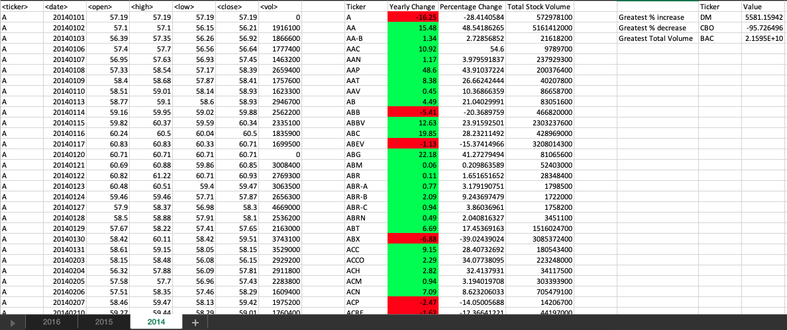
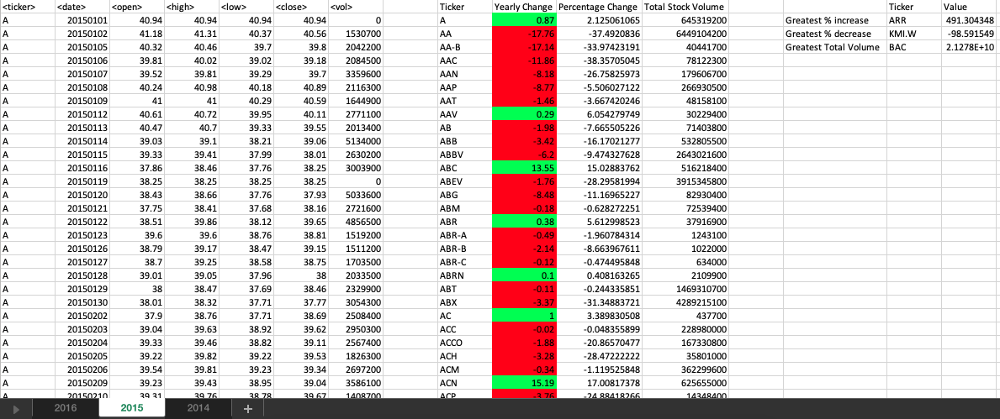
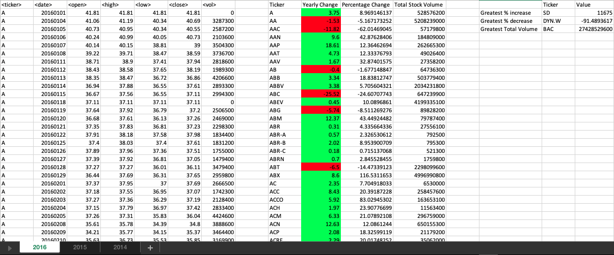

# Stock Market Analysis

This activity is focused on using VBA scripting to analyze real stock market data. This script loop through all the stocks for one year and output the following information:

* Ticker symbol
* Yearly change from opening price at the beginning of a given year to the closing price at the end of that year
* The percent change from opening price at the beginning of a given year to the closing price at the end of that year
* The total stock volume of the stock.
* Conditional formatting that highlight positive change in green and negative change in red
* Return the stock with the "Greatest % increase", "Greatest % decrease" and "Greatest total volume"

## Features 

* Advanced VBA 
* Summary statistics

## Built with 

* Visual Basic for Applications(VBA)

## Outcomes

2014 Results

2015 Results

2016 Results

